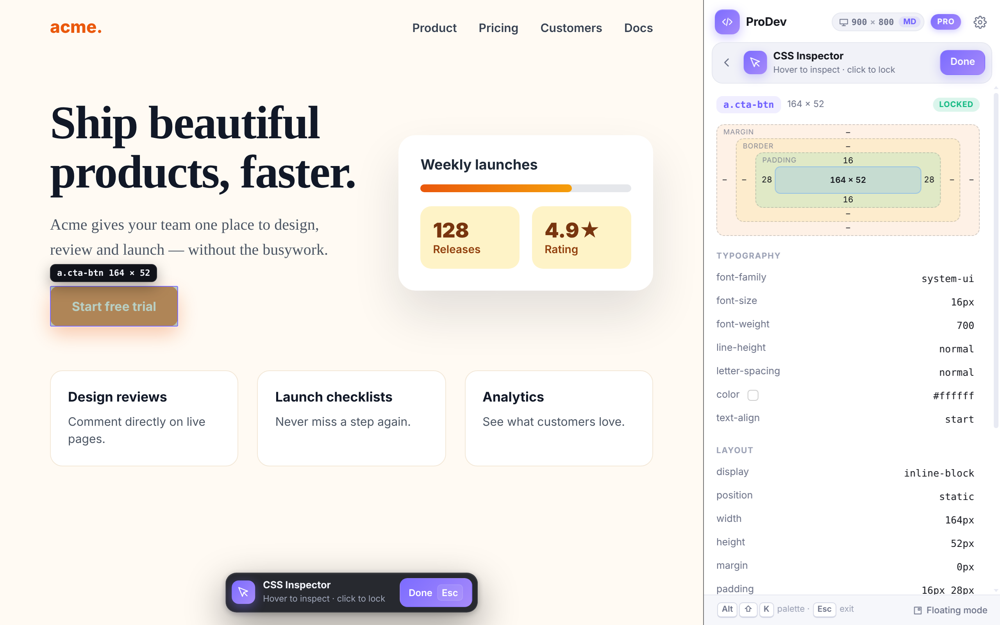
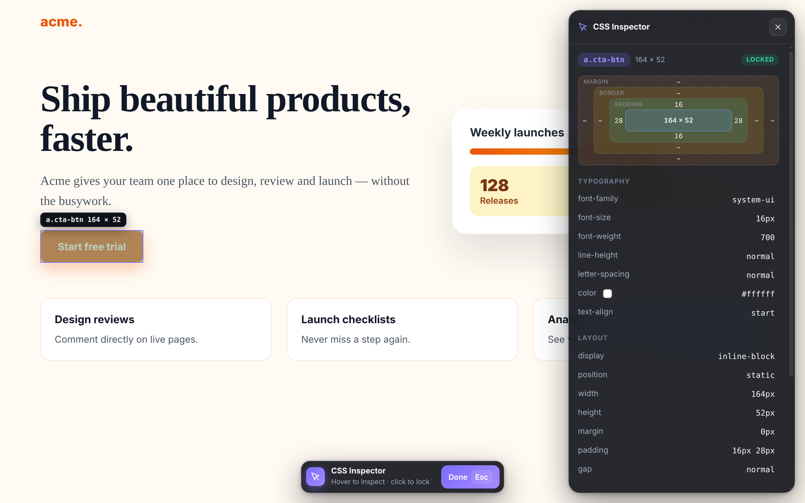

# Hairline: CSS Inspector & Dev Tools

A Manifest V3 Chromium extension (Chrome, Edge, Brave) with 15 tools to inspect, edit and export any website.
Freemium: core tools are free, Pro tools unlock with a one-time licence key.

| Tool | Tier |
|---|---|
| CSS Inspector (live editing = Pro), Live Text Editor, List All Fonts, Color Picker, Delete Element, Page Ruler, Page Outliner, Screenshot (full page = Pro), Send to AI (Ask free; Recreate, Edit with words, Accessibility and Style guide = Pro) | Free |
| Fonts Changer, Color Palette, Move Element, Export Element, Extract Images, Image Replacer | Pro |

## How it's put together
- **Side panel (default)**: clicking the toolbar icon opens Chrome's side panel (`sidepanel.html`): tool launcher plus each tool's view. It persists across tabs and navigation and shows the page's viewport width and breakpoint, since the panel narrows the page.
- **Floating mode** (Settings → *Where tools appear*): the toolbar icon opens the popup and tool views float over the page in a Shadow DOM panel. Closing the side panel while a tool is active hands it over to floating mode automatically.
- **Shared views**: each tool's UI is one Preact component in `extension/src/views/ToolViews.tsx`, rendered in either surface. Content-script tools publish data (`runtime.publish`) and handle actions (`onAction`); the views never touch the page directly.
- **On the page** only what must be there: highlights, box-model shading, ruler, outlines, and a small status pill with *Done/Esc*.
- **Permissions**: `activeTab` by default. The side panel offers an optional "Allow on all sites" (`optional_host_permissions`) so it can keep working as you switch tabs and navigate.

## Screenshots


| Floating mode | Popup |
|---|---|
|  |  |

Regenerate all screenshots (popup, settings, every tool panel, upsell, command palette) with
`E2E=1 npm run build && CHROMIUM_PATH=/path/to/chromium node scripts/screenshots.mjs`.

## Develop
```bash
npm install
npm run dev        # watch build into dist/
npm run build      # production build
npm run typecheck && npm run lint && npm test
npm run test:e2e   # Playwright (set CHROMIUM_PATH to a Chromium binary)
npm run zip        # hairline-<version>.zip for the Chrome Web Store
```
Load `dist/` via `chrome://extensions` → Developer mode → Load unpacked.

## Before launch (TODO)
- Final name / trademark + domain check, replace placeholder icons (`scripts/icons.mjs` generates temporary ones).
- Deploy the licence proxy and set `CONFIG` in `extension/src/lib/licence.ts` (see Payments below).
- Marketing site, privacy policy, store screenshots/promo tiles, listing copy.
- Test on complex sites (SPAs, iframes, shadow DOM) in Chrome, Edge and Brave.

## Payments (Creem)
Pro is a one-time Creem purchase that comes with a licence key. Creem's licence API needs your secret
API key, so the extension talks to a tiny PHP proxy instead (`server/licence.php`), never to Creem directly.

1. In Creem, create the **Hairline Pro** product (one-time, $29) with **licence keys** enabled and an
   activation limit (e.g. 3 browsers). Note its product ID and the checkout link.
2. Upload `server/licence.php` to any PHP 8+ host with curl (e.g. `https://hairline.app/licence.php`).
   Copy `server/config.example.php` to `config.php` with your API key and product ID, ideally outside
   the web root (point `HAIRLINE_CONFIG` at it), or set the same names as environment variables.
   Use `CREEM_API_BASE=https://test-api.creem.io` and a test key while testing.
3. In `extension/src/lib/licence.ts` set `licenceUrl` and `checkoutUrl`, and put the proxy's origin in
   `host_permissions` in `extension/manifest.json`. On the site, set `checkoutUrl` in `site/main.js`.

Buyers get the key from Creem's receipt and paste it into Hairline → Settings → Activate Pro. The extension
re-validates about once a day and keeps Pro unlocked offline for 14 days. `php server/test.php` exercises
the proxy against a fake Creem.

## Marketing videos
Two-stage pipeline in `scripts/marketing/` (footage is the real extension; output is not committed):

```bash
E2E=1 npm run build
export CHROMIUM_PATH=/path/to/chromium
TAKES=media/takes node scripts/marketing/capture.mjs            # record takes (2x, page + side panel)
TAKES=media/takes OUT=media/marketing node scripts/marketing/render.mjs [video ...]
```

- `capture.mjs`: drives the extension on the demo sites in `scripts/marketing/sites/` and records each
  take with marks (`take.json`). Re-run a single take by name, e.g. `capture.mjs inspector`.
- `edits.mjs`: shot lists, captions, camera moves and layouts for every video. The product name only
  appears in `BRAND` (end cards), so a rename is a one-line change plus a re-render.
- `director.html` + `render.mjs`: frames each shot (in a generic browser window on the brand stage, or
  tightly cropped to just the page + side panel for the website's `bare` layout) and renders frame by
  frame → MP4 (+ WebM and poster for web loops) and a contact sheet per video.

Outputs: `hero-loop` and `site-*` loops (1920×1200, tight crop for the website), `feature-*` loops (1920×1080, seamless), `product-tour` (~90s), `social-square`
(1080×1080) and `social-vertical` (1080×1920). Silent by design (autoplay-friendly); add music in an editor.
