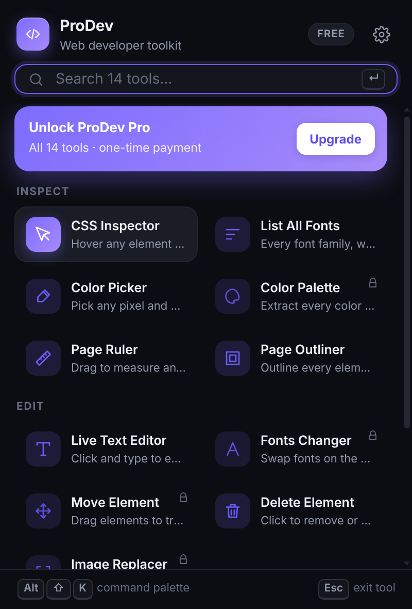
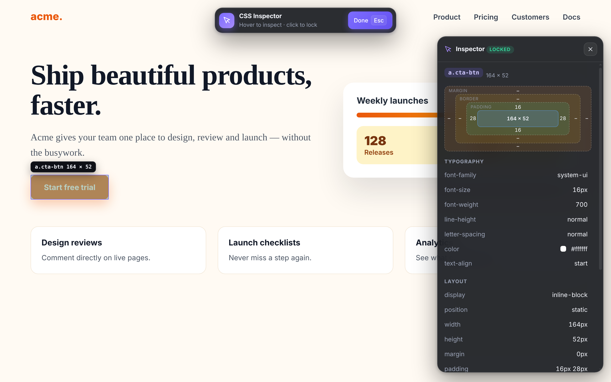

# ProDev – Web Developer & Designer Toolkit

A Manifest V3 Chromium extension (Chrome, Edge, Brave) with 14 tools to inspect, edit and export any website.
Freemium: core tools are free, Pro tools unlock with a one-time licence key.

| Tool | Tier |
|---|---|
| CSS Inspector (live editing = Pro), Live Text Editor, List All Fonts, Color Picker, Delete Element, Page Ruler, Page Outliner, Screenshot (full page = Pro) | Free |
| Fonts Changer, Color Palette, Move Element, Export Element, Extract Images, Image Replacer | Pro |

## Screenshots
| Popup | In-page inspector |
|---|---|
|  |  |

Regenerate all screenshots (popup, settings, every tool panel, upsell, command palette) with
`E2E=1 npm run build && CHROMIUM_PATH=/path/to/chromium node scripts/screenshots.mjs`.

## Develop
```bash
npm install
npm run dev        # watch build into dist/
npm run build      # production build
npm run typecheck && npm run lint && npm test
npm run test:e2e   # Playwright (set CHROMIUM_PATH to a Chromium binary)
npm run zip        # prodev-<version>.zip for the Chrome Web Store
```
Load `dist/` via `chrome://extensions` → Developer mode → Load unpacked.

## Before launch (TODO)
- Final name / trademark + domain check, replace placeholder icons (`scripts/icons.mjs` generates temporary ones).
- Set `CONFIG` in `extension/src/lib/licence.ts` (Lemon Squeezy store/product IDs, real checkout URL).
- Marketing site, privacy policy, store screenshots/promo tiles, listing copy.
- Test on complex sites (SPAs, iframes, shadow DOM) in Chrome, Edge and Brave.
